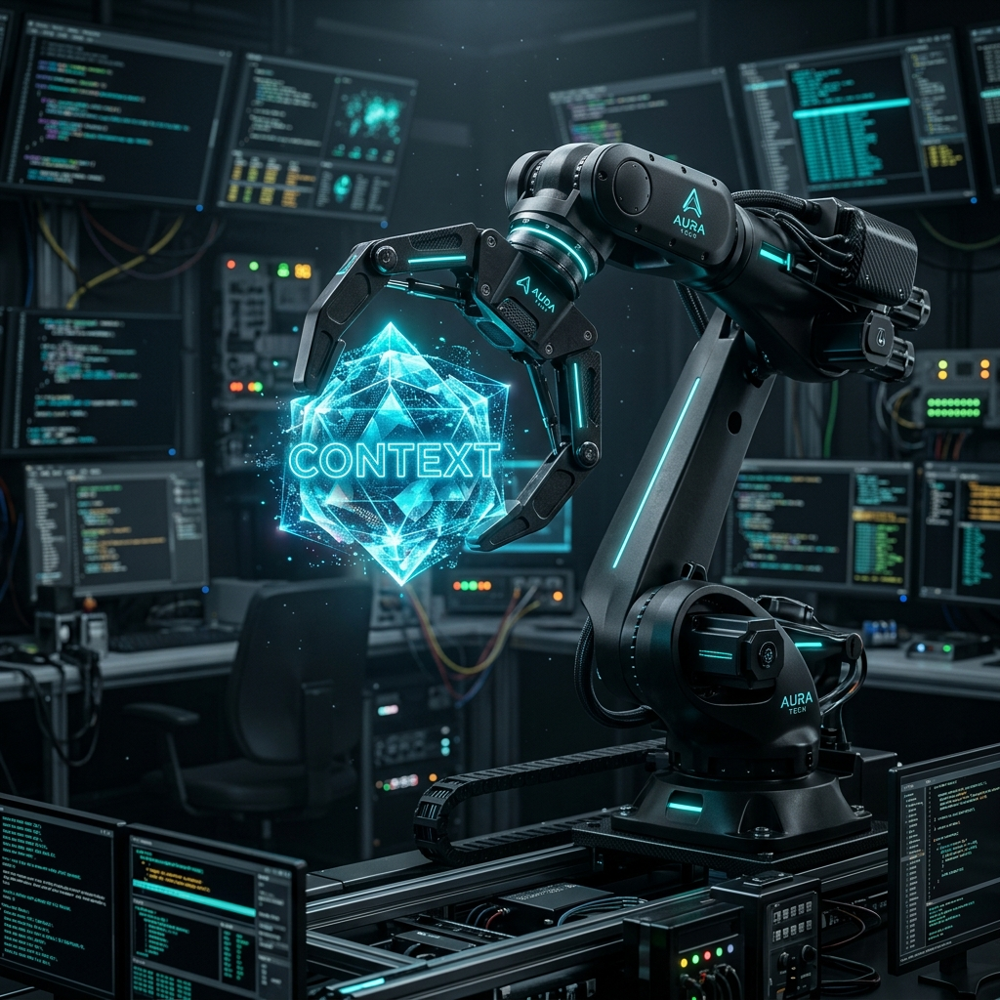

# VibeClaw-Workbench 🦾💎



## Overview
**VibeClaw-Workbench** is an environment orchestration and context sanitization core. This tool is for securing technical execution environments by purging non-whitelisted context and validating industrial manifests. Optimized for forensic-grade isolation and zero-leak automation.

## 🛠️ Industrial Features
- **Context Purge**: Automated forensic sanitization of environment variables.
- **Manifest Validation**: Real-time verification of `AGENTS.md` and technical protocols.
- **Forensic Logging**: Industrial-grade audit trails for every environment shift.
- **Vibe Lock**: Ensures execution context remains locked to predefined whitelists.

## 📂 Structure
- `src/`: Core logic and orchestration engine.
- `docs/`: Technical specifications and forensic standards.
- `tests/`: Unit and integration validation.
- `scripts/`: Deployment and maintenance automation.

## 🚀 Quick Start
```bash
python src/VibeClaw-Workbench.py
```

## 📜 Industrial License
Proprietary Industrial Suite. Optimized for x0VIER Forensic Operations.
